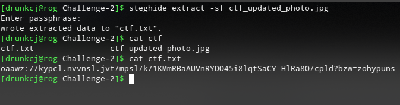
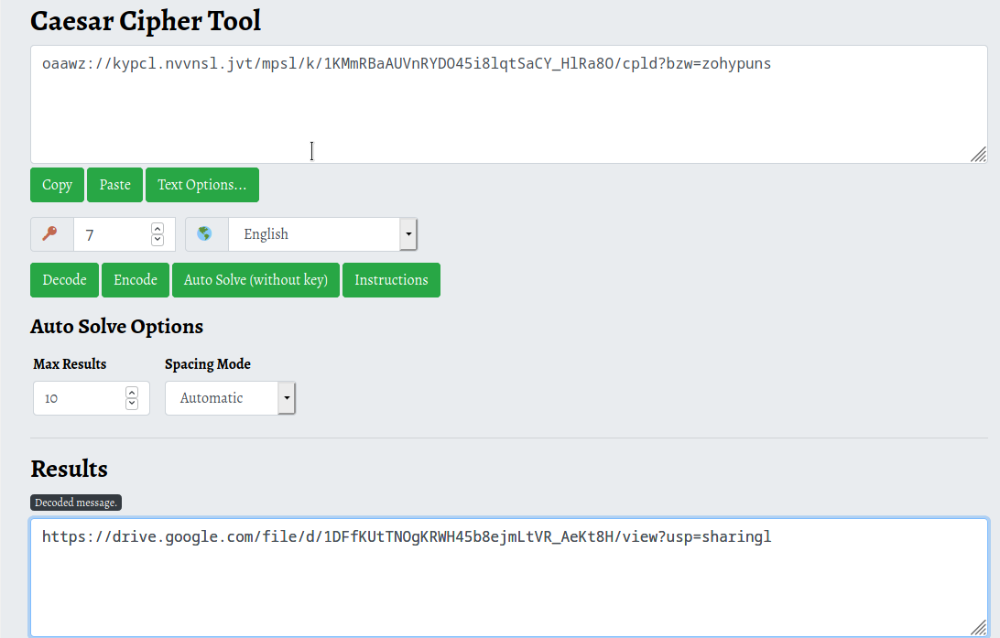
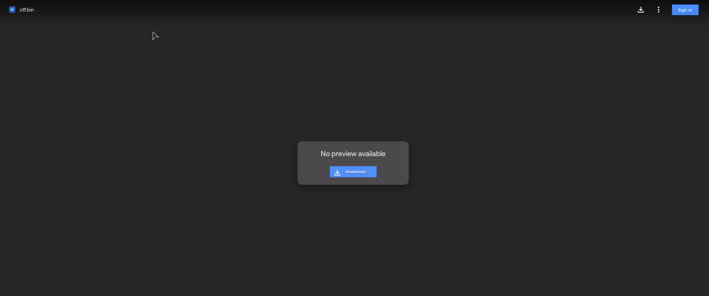
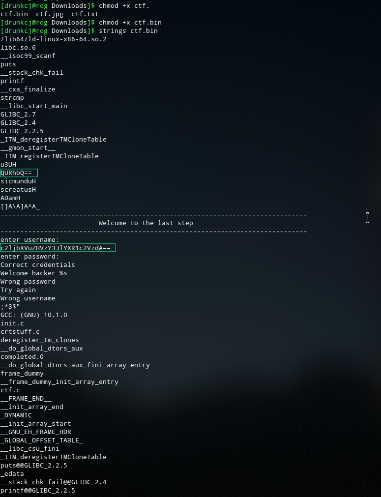
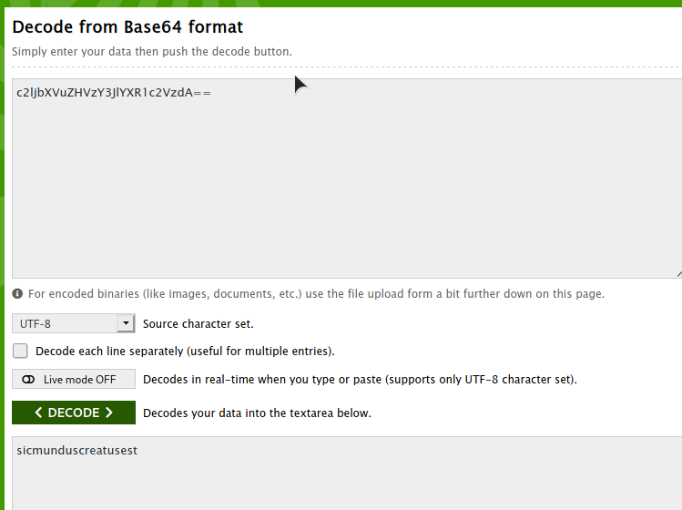
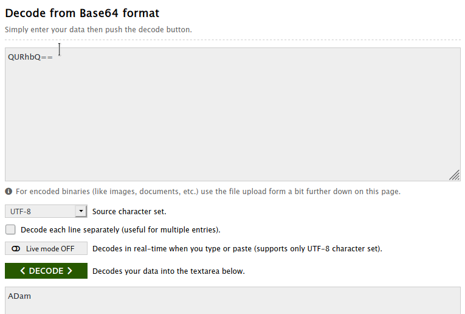
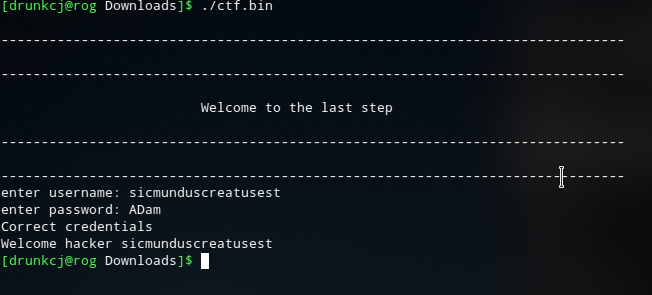

# Challenge-2
A basic level ctf challenge for beginners
## update: the image has been changed due to link issues it should work now
## download the image file present in this repo
- hint: the answer of the riddle is the password to something
- hint: the end is when u get a  message called "Welcome Hacker (followed by a username u have to find) "
# STEPS TO SOLVE:
## Step 1: Steghide 
the answer of the riddle is seven. seven is the key with which we hid the data inside the image.
We can extract data from the image by 
```
steghide extract -sf ctf_updated_photo.jpg
```


## Step 2: Solving the ciphered output
it is a caeser cipher with a 7 digit shift

## Step 3 : visiting the link and downloading the file in it

## Step 4 : finding the username and password of the bin file
Strings is a command which is used to print string literals from binary executables

>**as you can see there are two entries in the output which ends with "==" sign**
>**"==" denotes base64 cipher**\
### username

### password

### Step 5: executing the bin file with the credentials

**u did it congrats**


### Want to buy me a coffee: https://www.paypal.me/drunkcj
